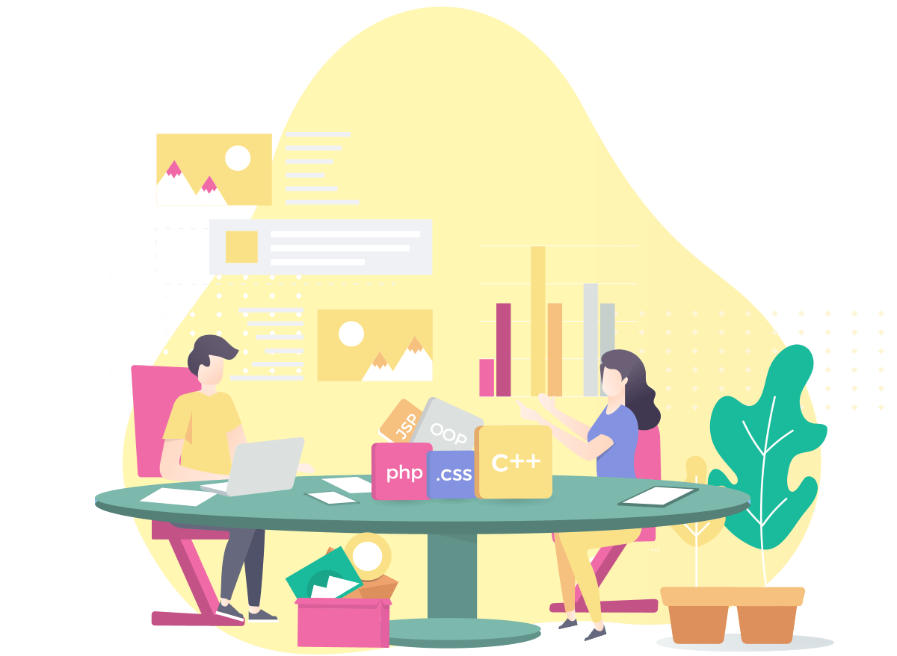

**Hello, my name is Michael.**  

I can’t stand an ugly and incorrect code so much that at the slightest glance at it my whole body
is covered with convulsions and an unshakable desire to fix everything😱.
**This is my main advantage and disadvantage at the same time. I spend a lot of time on details🕘.**   

I believe that every programmer developing an open source project should treat coding as an art🎨.  

Code is no doubt a tool for making money, but code is your face too.

